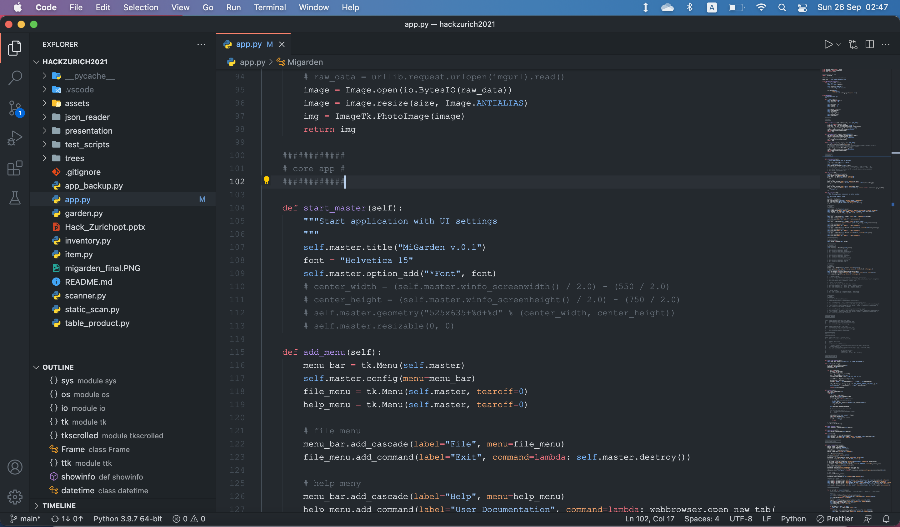

# MiGarden

## Inspiration
Most people got used to buying products with a high cost-efficiency. However, high cost-efficiency for human-beings does not necessarily mean the same for our environment. Although the products in Migros have been assigned a Klima check, Tierwohl check, and other labels, customers easily ignore them during the shopping.
To remind people of our environment while shopping, we have designed an interactive game, named MiGarden, in which people can collect Environment points (EP) by shopping for environment-friendly products. The environment points can be used in the app to grow a garden and gain rewards for their efforts.

MiGarden on DevPost: https://devpost.com/software/mygarden

## What it does

After shopping in Migros, customers will get a QR code on their receipt in which the information of the goods is recorded. Using the MiGarden App to scan the QR code, one can directly see the EP corresponding to each product and their sum. Then they can transfer the points to their virtual garden to sow, fertilize, or water different plants. Once the trees are fully grown, people can redeem their score for e.g. a real apple in Migros, or to plant a tree in the real world.

## How we built it



Backend: Python, MongoDB <br>
Frontend: TkInter <br>
Special libraries: OpenCV, PyInstaller, NumPy <br>

## Prerequisites

- tkinter
- opencv (`brew install opencv`)
- pyzbar (`pip install pyzbar`)

## Installation

```sh
git clone git@github.com:rangsimanketkaew/hackzurich2021.git
pip install .
migarden
```

## Run the app

`python -m migarden.app`

## Challenges we ran into
 We had many good ideas for this App, but the limitations on time only allowed us to finish the skeleton.
 
## Accomplishments that we're proud of
We love the idea of a MiGarden app. Though virtual, it gives people the real fulfillment of seeing their trees grow, while giving them the opportunity to address the real environmental problems.

## What we learned
It was the first time we cooperated on a time-limited challenge. We learned how to clearly distribute the workloads and to communicate more effectively.
 
## What's next for MiGarden
Implementation of multiplayer and multi-platform.
Extension of libraries of plants and rewards.

## Who are we

- Eva Vandaele
- Lukas Schreder
- Rangsiman Ketkaew
- Ruocheng Han
